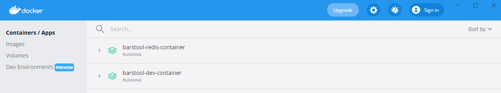
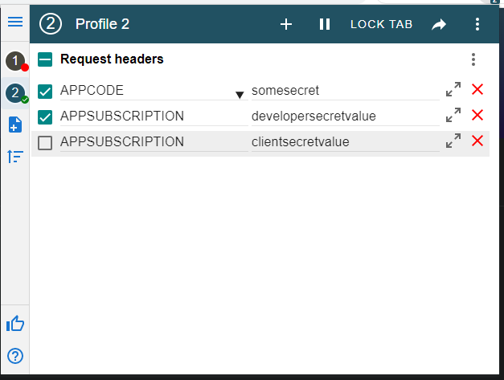
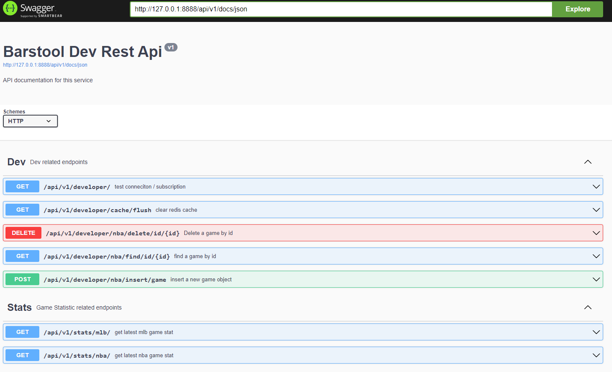
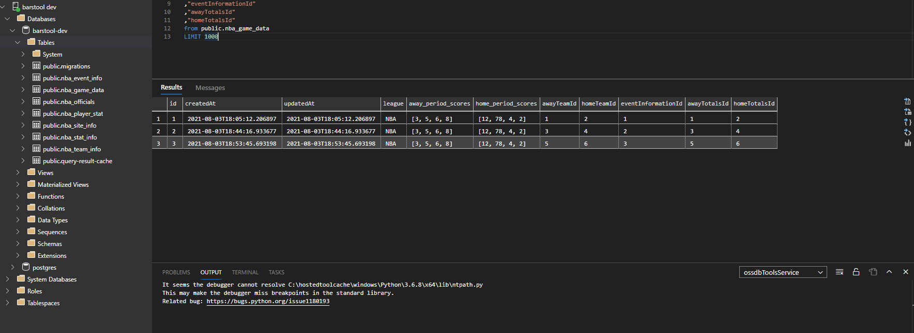
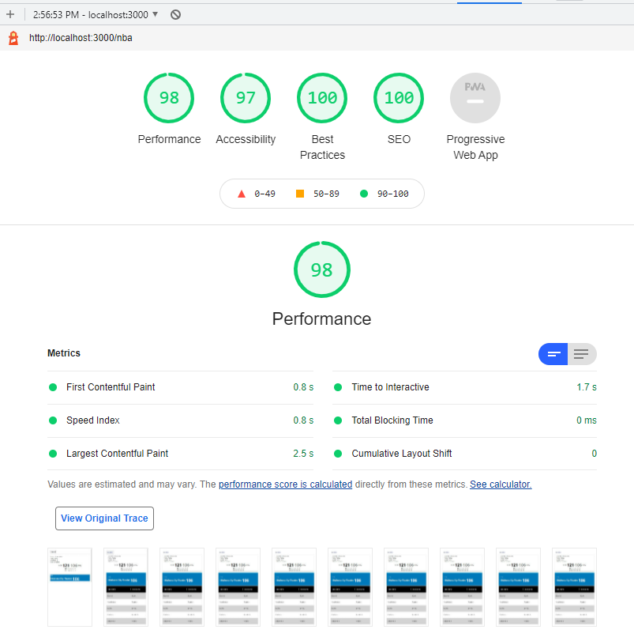

# Barstool Fullstack Challenege
Jude Giordano

### [challenge reference](https://github.com/BarstoolSports/fullstack-challenge)
---
## Prerequisites
- [node.js](https://nodejs.org/en/)
- [docker](https://www.docker.com/)
- [modheader](https://modheader.com/) (optional)
- [azure data studio](https://docs.microsoft.com/en-us/sql/azure-data-studio/download-azure-data-studio?view=sql-server-ver15) (optional)
---
# Running Locally

1. # Container Services
    - The backend and frontend work in tandem on node.js. There are a number of `.env` variables that have been tracked in version control for local development.
    - There are two `docker-compose.yml` files inside  [./barstool-database-container](./barstool-database-container) and [./barstool-redis-container](./barstool-redis-container). It is necessary to compose these docker containers for the backend to properly make use of their services. Included in each container folder is a `up.ps1` powershell script for spinning up each image. Alternatively, you could run 
        ```sh
        docker-compose up -d --build
        ```
        inside each previously mentioned container folder.
    - Once started, you should see two instances running in docker, like so:
    
    - The two services are a Postgres SQL db and a Redis in-memory NoSQL db.
    - Postgres volume data will be automatically stored in its appropriate container folder, under `./barstool-database-container/data/db/*`. This ensures data is persisted even if the container is composed down.

2. # [./Migrations](./backend/src/Migrations/)
    - I have included a migrations folder for getting your local db instance in line with the state of the backend app.
    - Open a terminal in `./backend` and run:
        ```js
        npm install
        // then
        npm run db:up
        ```
    - This will execute the latest migration (located in [./backend/src/Migrations](./backend/src/Migrations/)) against the postgres db.
3. # Commands
    - This step assumes that the Redis container and Postgres db container are running as a service already.
    - To start the backend, run the following 2 commands inside a terminal in the [./backend](./backend/) directory:
        ```js
        npm install
        // then
        npm run start
        ```

        This will use the typescript compiler to build the project and start the backend app. For connecting to the [api](http://127.0.0.1:8888/api/v1/docs/static/) in browser, see [backend](#backend).
    - To run the Frontend, run the following 2 commands in a terminal inside the [./frontend](./frontend/) directory:
        ```js
        npm install
        // then
        npm run start
        ```
        This will use Next to create an optimized production build and start it on [http://localhost:3000](http://localhost:3000).

 4. # [./Backend](./backend/)
    - The backend framework I have chosen is [Fastify](https://www.fastify.io/), mostly as I prefer its performance over Express, Hapi, or Koa.
    - The Below `.env` file is included in the backend folder.
        ```sh
        APP_VERSION=v1
        PORT=8888
        HOST=127.0.0.1
        APPCODE=somesecret

        # db
        NODE_ENV=development
        DB_TYPE=postgres
        DB_HOST=localhost
        DB_PORT=6666
        DB_USERNAME=dev-admin
        DB_PASSWORD=dev
        DB_NAME=barstool-dev
        DB_SYNC=true
        DB_LOGGING=true

        # redis
        REDIS_HOST=127.0.0.1
        REDIS_PASSWORD=barstool-redis-password
        REDIS_PORT=6379

        # subscriptions
        DEV_SUBSCRIPTION=developersecretvalue
        CLIENT_SUBSCRIPTION=clientsecretvalue
        ```
    - The security model I have chosen follows a Code / Subscription model where `APPCODE` determines connection authorization and `*_SUBSCRIPTION` deteermines elevation.
    - For Example, a user passing the following headers
        ```js
        {
            APPCODE: somesecret,
            APPSUBSCRIPTION: developersecretvalue
        }
        ```
        will be recognized as a developer, and will have access to execute all endpoints.
    - However, the frontend app is given a less-elevated subscription header, and will only have authorization to certain endpoints.
    - Without at least an `APPCODE` header, connection to the backend will be rejected, so I recommend using [modheader](https://modheader.com/) (or similar browser header editors) to apply the header values to your browser.
    
        

    - I have also included swagger documentation for the backend, reachable on `http://127.0.0.1:8888/api/v1/docs/`
    which should render:
    
        


    - The main backend rest endpoint of interest is under the scope of `http://127.0.0.1:8888/api/v1/stats/`. This will make a request out the [Bartsool api](https://chumley.barstoolsports.com/dev/data/games/6c974274-4bfc-4af8-a9c4-8b926637ba74.json) for game data.
    - It then caches the response into Redis, as well as inserts a game object into the postgres db so all previous game data is back-logged
    
    - On subsequent requests, the backend checks if Redis has any data cached, if so, it saves a trip and instantly returns with the cached payload.
    - If the redis data is older than 60 seconds (15 seconds being the max as per the requirements) from its last insertion, it will fetch a new version of the data from the Barstool api and cache that response instead, as well as storing this new version of the data in the Postgres db.
5. # [./Frontend](./frontend/)
    - The Frontend is written using [Next.js](https://nextjs.org/). It uses the following `.env` file to ensure basic client connection without the ability to perform dangerous commands such as deleting db data.
        ```sh
        NODE_ENV=development
        BACKEND_APPCODE=somesecret
        BACKEND_APPSUBSCRIPTION=clientsecretvalue
        BACKEND_ENDPOINT=http://127.0.0.1:8888/api/v1/
        ```
    - Once built, the Next app offers impressive performance and SEO results, here is a snip of my latest [Lighthouse](https://developers.google.com/web/tools/lighthouse/) report:
    
    - The frontend uses Incremental Static Regeneration to export a static cache of the widget page and silently rebuild the page in the background for subsequent loads.
        ```ts
        export const getStaticProps: GetStaticProps = async () => {

            const { data } = await Rest.Get("stats/nba/");

            return {
                props: {
                    statData: data.data
                },
                revalidate: 60 // <- revalidate after 60 seconds
            };
        };
        ```

6. # [Types Repo](https://github.com/judegiordano/bartsool-dev-types)
    - I have also published an npm package for help with consistent
    typing across the frontend and backend :)
    - for installation, run 
        ```
        npm i git+https://github.com/judegiordano/bartsool-dev-types.git
        ```
---
